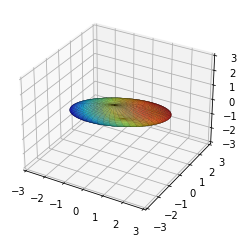

# About

Thirs repository is a compilation of my code written during learning about SVG (singular value decomposition).

Most of the code is a translation of what prof. Steve Brunton is explaining in his great video lectures and his book avaliable online on http://databookuw.com/

# The basics
Decomposition splits matrix X into three other matrices U, S (sigma) and V. U and V can be seen as matrices of eigenvectors of transformation X@XT (X transposed). Sigma matrix is square roots of an eigenvalues matrix.

# Image compression
As a first example of SVD we compressed an image to ilustrate concept of sorted eigenvalues and eigenvectors in the matrices. By getting only first 60 rows of computed SV decomposition we were able to keep fairly good compression - 11% of original size. Introduced Eckard-Young theorem tells us that this is best aproximation of original image in terms of Forbenius norm.

# Unitary transformation
This notebook deepens understanding of SVD. Unitary matrix U is a carrier of left rotation of space and S (sigma) warps the space.

# Simple linear regression
File: lin_regression_simple.ipynb

Demonstrates simple case of linear regression using SVD method. I learned how SVD extends solving Ax=b into non square matrices A to get the solution that has minimal ||*|| L2 norm.

